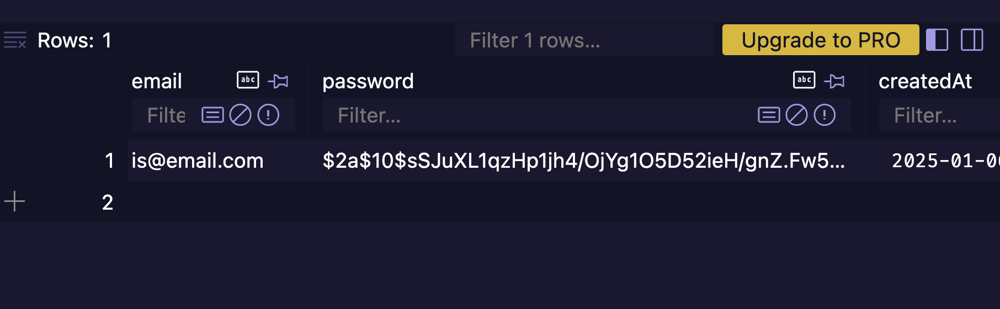

# SQA Assignment 

## Feature Implementation

| Feature  | Owner |
| ------------- |:-------------:|
| Blog Post Management: Implement features to search or sort blog posts effectively      | Nathan Voong     |
| User Profiles: Allow users to create, edit, delete, and view their profile details      | Asher De Souza     |
| Access Control: Restrict editing and deleting posts to their respective authors      | Arran McPherson     |
| User Authentication: Enable user registration and login functionality   | Isabella Sulisufi    |

## Testing
### TDD/BDD

### Evidence of running tests
### Evidence of achieveing the coverage report
### How edge cases and error conditions were tested

## Security Enhancements
### Password Hashing
### Password Hashing
We decided not to encrypt passwords as it relies on an encryption key to decrypt the data back into its original form. Even if we store this key securely in environment variables, there's still a risk: if someone gains access to the key, they could decrypt and expose all stored passwords.

We decided to hash the passwords using [bcrypt](https://www.npmjs.com/package/bcryptjs). Hashing is a one-way operation, meaning once a password is hashed, it cannot be reversed back to its original form.
When users register, their password is hashed and stored in the database. During login, the input password is hashed again and compared to the stored hash, ensuring the original password is never stored or exposed.

However, even hashing can cause hash collisions. If two users set the same password, they would have the same hash. Additionally, precomputed hash tables (rainbow tables) exist online for common passwords, making it easier for attackers to crack weak hashes.

To address this limitation, we added salting to our password hashing process. Each password is hashed with a unique, random salt, ensuring even identical passwords produce unique hashes, effectively preventing rainbow table attacks.

#### Implementation Details
**Registration**: Passwords are hashed with bcrypt using a salt round of 10
`(bcrypt.hash(password, 10))`
before being stored.

**Login**: User-entered passwords are compared securely using bcrypt.compare, ensuring the plain text password never touches our database.

#### Example picture of database where password entered was 123 and it shows the hashed password

By using hashing with salting, we've significantly enhanced our password security. Users’ credentials are better protected against common attacks like rainbow table lookups and hash collisions, ensuring that their sensitive information remains confidential even in the event of a database breach.
### CSRF Protection 
### Input Validation
### Any additional configurations or tools used

## Code Quality and Refactoring
### Sections of the code demonstrating modularisation
### Key improvements made during refactoring
### 
## CI/CD and Git Practices

### GitHub Actions Used
### How we colllaborated
